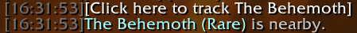

## Description ##

This addon will create a link in chat to automatically run the .findnpc command when near a rare.

## Installation ##

Download this repository, then extract the `ScootsRares` subdirectory from the `src` directory into your `World of Warcraft/Interface/AddOns` directory.

## Screenshots ##

